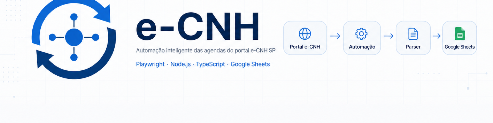
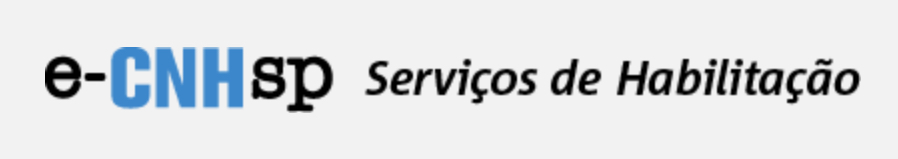

<p align="center">
  
</p>

<p align="center">
  
</p>

<h1 align="center">e-CNH</h1>

<p align="center">
  <strong>
    Automatiza a sincronização das agendas do portal e-CNH SP para o Google Sheets,<br />
    eliminando processos manuais e mantendo uma visão consolidada dos pacientes.
  </strong>
</p>

<p align="center">
  Consulta agendas automaticamente, aplica regras de negócio e sincroniza<br />
  <strong>pacientes ativos</strong> para o <strong>Google Sheets</strong>.
</p>

<p align="center">
  
  
  
</p>

<p align="center">
  
  
  
  
</p>

<p align="center">
  <a href="#visao-geral">Visão</a>
  &nbsp;·&nbsp;
  <a href="#como-funciona">Fluxo</a>
  &nbsp;·&nbsp;
  <a href="#funcionalidades">Funcionalidades</a>
  &nbsp;·&nbsp;
  <a href="#stack">Stack</a>
  &nbsp;·&nbsp;
  <a href="#como-executar">Executar</a>
  &nbsp;·&nbsp;
  <a href="#documentacao">Docs</a>
</p>

---

<br />

<a id="visao-geral"></a>

## ✨ Visão Geral

O **e-CNH** é um sincronizador backend que elimina o trabalho manual de abrir o portal, autenticar profissionais e copiar agendas para planilha.

| | |
| --- | --- |
| **Problema** | Consultar o portal por profissional, extrair pacientes e manter a planilha atualizada é lento e propenso a erro. |
| **Como funciona** | Autentica via HTTP, consulta agendas futuras, parseia HTML SSR, aplica regras (ativos, CPF, unidade) e grava na aba `Agenda`. |
| **Benefício** | Uma visão consolidada, previsível e auditável — sob demanda ou em horário agendado. |

> Não é um app web para usuários finais. É integração operacional que alimenta o Google Sheets.

<br />

---

<br />

<a id="como-funciona"></a>

## 🔄 Como Funciona

```mermaid
%%{init: {"flowchart": {"htmlLabels": true, "nodeSpacing": 36, "rankSpacing": 48, "padding": 12, "curve": "basis"}, "themeVariables": {"fontSize": "16px"}} }%%
flowchart LR
  A([Portal e-CNH SP]) --> B[Autenticação HTTP]
  B --> C[Consulta da agenda]
  C --> D[Extração HTML SSR]
  D --> E[Parser tipado]
  E --> F[Regras de negócio]
  F --> G[Google Sheets API]
  G --> H([Aba Agenda atualizada])

  style A fill:#E3F2FD,stroke:#1976D2,color:#0A2540
  style B fill:#FFFFFF,stroke:#90CAF9,color:#0A2540
  style C fill:#FFFFFF,stroke:#90CAF9,color:#0A2540
  style D fill:#FFFFFF,stroke:#90CAF9,color:#0A2540
  style E fill:#FFFFFF,stroke:#90CAF9,color:#0A2540
  style F fill:#FFF8E1,stroke:#F9A825,color:#0A2540
  style G fill:#FFFFFF,stroke:#90CAF9,color:#0A2540
  style H fill:#E8F5E9,stroke:#0F9D58,color:#0A2540
```



| Etapa | O que acontece |
| --- | --- |
| Autenticação | Sessão HTTP com CookieJar (Axios) |
| Consulta | Datas futuras e HTML da agenda por profissional |
| Parser | Cheerio → modelos tipados (`Agenda` / paciente) |
| Regras | Ativos (hoje+), deduplicação por CPF, unidade operacional |
| Persistência | Reescrita controlada da aba `Agenda` |

Detalhes técnicos: [Arquitetura](docs/ARQUITETURA.md) · [Fluxo HTTP](docs/FLUXO_HTTP.md)

<br />

---

<br />

<a id="funcionalidades"></a>

## 🚀 Funcionalidades

| | Capacidade | Descrição |
| :---: | --- | --- |
| 🔐 | **Login automatizado** | Autenticação HTTP com cookies e logout seguro |
| 👨‍⚕️ | **Multi-profissional** | Vários usuários `ECNH_USER_*` em uma execução |
| 🏥 | **Multi-unidade** | Escolha de Perfil / Visão por configuração |
| 📅 | **Consulta automática** | Agendas por data sem interação manual |
| 📄 | **Parser HTML** | HTML SSR → domínio tipado |
| 📊 | **Google Sheets** | Persistência na aba `Agenda` |
| 🆔 | **Deduplicação por CPF** | Evita duplicatas no ciclo ativo |
| 🔄 | **Atualização incremental** | Insere novos, preserva ativos, remove datas passadas |
| ⏰ | **Scheduler** | Daemon com `node-cron` |
| 🔒 | **Lock** | Impede execuções concorrentes |

<br />

---

<br />

## 🖼 Screenshots

<p align="center">
  <em>Capturas reais poderão ser adicionadas futuramente.</em><br />
  <sub>Os blocos abaixo são <strong>placeholders</strong> — substitua pelos arquivos em <code>docs/assets/screenshots/</code> quando disponíveis.</sub>
</p>

| Portal | Google Sheets |
| :---: | :---: |
| <!-- screenshot: portal --> | <!-- screenshot: sheets --> |
| 📷 *placeholder* | 📷 *placeholder* |
| *Portal e-CNH (autenticado)* | *Aba Agenda sincronizada* |
| `docs/assets/screenshots/portal.png` | `docs/assets/screenshots/sheets.png` |

| Scheduler | Fluxo |
| :---: | :---: |
| <!-- screenshot: scheduler --> | <!-- screenshot: fluxo --> |
| 📷 *placeholder* | 📷 *placeholder* |
| *Daemon / logs do job* | *Pipeline de sincronização* |
| `docs/assets/screenshots/scheduler.png` | `docs/assets/screenshots/fluxo.png` |

Banner do projeto: [`docs/assets/banner-ecnh-ai.png`](docs/assets/banner-ecnh-ai.png) · variante vetorial: [`docs/assets/banner-ecnh.png`](docs/assets/banner-ecnh.png)

<br />

---

<br />

<a id="stack"></a>

## ⚙️ Stack

<p align="center">
  
  
  
  
  
  
  
  
</p>

| Camada | Tecnologias |
| --- | --- |
| **Runtime** | Node.js 20+ · TypeScript |
| **HTTP / sessão** | Axios · tough-cookie · http-cookie-agent (CookieJar) |
| **Parsing** | Cheerio |
| **Persistência** | Google Sheets API v4 (`googleapis`) |
| **Observabilidade** | Pino |
| **Agendamento** | node-cron · proper-lockfile |
| **Validação** | Zod (fronteiras, quando aplicável) |

<br />

---

<br />

## 📁 Estrutura

```text
e-CNH/
├── src/
│   ├── client/          # Portal HTTP + Google Sheets
│   ├── composition/     # Wiring dos entrypoints
│   ├── config/          # Ambiente e profissionais
│   ├── jobs/            # Daemon, cron, SyncLock
│   ├── models/          # Domínio
│   ├── parsers/         # HTML → tipado
│   ├── repositories/    # Persistência Agenda
│   ├── scripts/         # CLIs e validadores
│   ├── services/        # Casos de uso
│   └── utils/
├── docs/                # Arquitetura, ADRs, backlog, evidências
├── .fases/              # Histórico das fases do MVP
├── fixtures/            # Fixtures de parser
└── AGENTS.md            # Regras do repositório
```

<br />

---

<br />

<a id="como-executar"></a>

## ▶️ Como Executar

### 1. Instalação

```bash
npm install
cp .env.example .env
```

Preencha portal (`ECNH_*`), profissionais (`ECNH_USER_*`) e Google Sheets.
Para o daemon, defina `AGENDA_SYNC_CRON` (ex.: `0 17 * * *` com `AGENDA_SYNC_TZ=America/Sao_Paulo`).

### 2. Sincronização

| Modo | Comando | Comportamento |
| --- | --- | --- |
| **Manual** | `npm run sync:agenda` | Uma execução sob demanda e encerra |
| **Daemon** | `npm run job:agenda` | Processo longo; dispara no cron configurado |

```bash
# Sob demanda
npm run sync:agenda

# Agendado (processo precisa permanecer vivo)
npm run job:agenda
```

> Sem `sync:agenda` e sem `job:agenda` em execução, a planilha **não** atualiza sozinha.

### 3. Qualidade

```bash
npm run typecheck && npm run lint && npm test && npm run build
```

Validadores (`validate:*`, `discover:*`) → [docs/](docs/) e [.fases/](.fases/).

<br />

---

<br />

## ✅ Estado do Projeto

| | Status |
| --- | :---: |
| MVP (Fases 000–007) | ✔ Concluído |
| Sistema operacional | ✔ |
| Multi-profissional | ✔ |
| Multi-unidade | ✔ |
| Google Sheets | ✔ |
| Scheduler + lock | ✔ |

<p align="center">

| ✔ MVP concluído | ✔ Sincronização manual | ✔ Scheduler automático | 🔄 Melhorias contínuas |
| :---: | :---: | :---: | :---: |

</p>

<br />

---

<br />

## 🗺 Roadmap

| Status | Item |
| :---: | --- |
| ✅ | MVP |
| ✅ | Parser |
| ✅ | Google Sheets |
| ✅ | Scheduler |
| 🔄 | Deploy Railway |
| 🔄 | Execução 24/7 |
| 🔄 | Dashboard |
| 🔄 | Histórico de sincronizações |
| 🔄 | Logs centralizados |
| 🔄 | Monitoramento |

Fontes oficiais: [BACKLOG.md](docs/BACKLOG.md) · [ROADMAP.md](docs/ROADMAP.md)

<br />

---

<br />

<a id="documentacao"></a>

## 📚 Documentação

| Recurso | Conteúdo |
| --- | --- |
| [docs/](docs/) | Documentação técnica completa |
| [Visão do produto](docs/VISAO_DO_PRODUTO.md) | Objetivo, usuários, escopo |
| [Arquitetura](docs/ARQUITETURA.md) | Camadas e limites de integração |
| [ADRs / Decisões](docs/DECISOES.md) | Decisões arquiteturais |
| [API / protocolo](docs/API.md) | Contrato HTTP com o portal |
| [Fluxo HTTP](docs/FLUXO_HTTP.md) | Sequência login → agenda |
| [.fases/](.fases/) | Documentos por fase do MVP |
| [CHANGELOG.md](CHANGELOG.md) | Diário de evolução |
| [AGENTS.md](AGENTS.md) | Regras para contribuidores e agentes |
| [Backlog](docs/BACKLOG.md) | Evoluções pós-MVP |

Arquivo forense 003A: [docs/archive/autenticacao-003a/](docs/archive/autenticacao-003a/) — histórico, não SoT do comportamento atual.

<br />

---

<br />

## 🔒 Segurança

Credenciais e secrets permanecem **locais** (`.env` e JSON da Service Account) e **não** fazem parte do repositório.

| Prática | Detalhe |
| --- | --- |
| Credenciais | Nunca versionadas (código, logs, fixtures ou commits) |
| Secrets | Apenas variáveis de ambiente (`.env` local, fora do Git) |
| Google Sheets | Autenticação via **Service Account** (JSON fora do repositório) |
| Dados sensíveis | CPF, senha, cookies e tokens não aparecem em logs |

<br />

---

<br />

<p align="center">
  <strong>e-CNH</strong><br />
  <sub>Simplicidade antes de complexidade · automação antes de trabalho manual · entregas pequenas e documentadas</sub>
</p>
