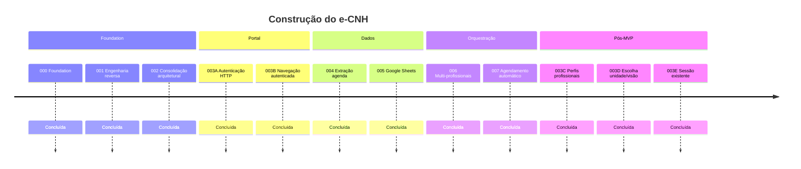
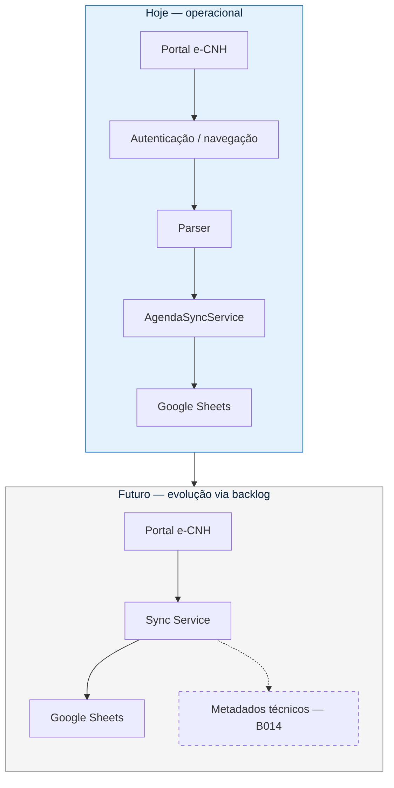

<p align="center">
  
</p>

<h1 align="center">Roadmap</h1>

<p align="center">
  <strong>Histórico oficial da construção do MVP e da evolução arquitetural do e-CNH.</strong>
</p>

<p align="center">
  Documento de planejamento e registro — cada fase resolveu um único problema,<br />
  sem antecipar funcionalidades posteriores.
</p>

<p align="center">
  
  
  
</p>

<p align="center">
  
  
  
</p>

<p align="center">
  <a href="../README.md">README</a>
  &nbsp;·&nbsp;
  <a href="ARQUITETURA.md">Arquitetura</a>
  &nbsp;·&nbsp;
  <a href="DECISOES.md">Decisões</a>
  &nbsp;·&nbsp;
  <a href="BACKLOG.md">Backlog</a>
  &nbsp;·&nbsp;
  <a href="../CHANGELOG.md">Changelog</a>
</p>

<p align="center">
  <a href="#visão-geral">Visão</a>
  ·
  <a href="#timeline">Timeline</a>
  ·
  <a href="#roadmap-por-fases">Fases</a>
  ·
  <a href="#estado-atual">Estado</a>
  ·
  <a href="#próximos-passos">Próximos</a>
  ·
  <a href="#estatísticas">Estatísticas</a>
</p>

---

<br />

## Visão Geral

Este roadmap registra **como o MVP foi construído** (Fases 000–007) e as **evoluções arquiteturais pós-MVP** (003C / B012, 003D / B011, 003E / B010).

| Papel | Documento |
| --- | --- |
| **Histórico do MVP + pós-MVP arquitetural** | Este arquivo (`ROADMAP.md`) |
| **Catálogo ativo de evoluções** | [BACKLOG.md](BACKLOG.md) |

A sequência reflete a separação arquitetural: **portal → extração → destino → orquestração → agendamento**.

### Como interpretar os status

Cada fase da **003A à 007** (e as evoluções 003C–003E) possui exatamente um estado e progride **sem saltos**:

`Planejada` → `Implementada` → `Validada` → `Concluída`

| Status | Significado |
| --- | --- |
| **Planejada** | Objetivo, escopo e critérios documentados; implementação ainda não finalizada. |
| **Implementada** | Escopo desenvolvido; validação da fase ainda pendente. |
| **Validada** | Critérios executados no ambiente adequado, com evidências registradas. |
| **Concluída** | Fase validada, sem pendências bloqueantes no escopo e com documentação obrigatória atualizada. |
| **Descontinuada** | Removida do escopo do produto; mantida só como registro histórico (ex.: 008, 009). |

> Um status de fase do MVP só muda quando a evidência correspondente estiver registrada no documento da fase e no diário do projeto ([CHANGELOG.md](../CHANGELOG.md)).

No [BACKLOG](BACKLOG.md), itens usam: `⏳ Pendente` · `🚧 Em andamento` · `✅ Concluído`.

<br />

---

<br />

## Timeline

Progressão visual do MVP (todas as fases abaixo estão **`Concluída`**):

```text
Fase 000 — Foundation
████████████████  Concluída
        ↓
Fase 001 — Engenharia reversa
████████████████  Concluída
        ↓
Fase 002 — Consolidação arquitetural
████████████████  Concluída
        ↓
Fase 003A — Autenticação HTTP
████████████████  Concluída
        ↓
Fase 003B — Navegação autenticada
████████████████  Concluída
        ↓
Fase 004 — Extração de dados da agenda
████████████████  Concluída
        ↓
Fase 005 — Integração Google Sheets
████████████████  Concluída
        ↓
Fase 006 — Orquestração multi-profissionais
████████████████  Concluída
        ↓
Fase 007 — Agendamento automático (cron)
████████████████  Concluída  ← fim do MVP
        ↓
Pós-MVP: 003C / 003D / 003E
████████████████  Concluídas
        ↓
Backlog ativo → B014 (⏳ Pendente)
```



<br />

---

<br />

## MVP do projeto (Fases 000–007)

As Fases **000 a 007** constituem o **MVP do projeto**.

**Status do MVP:** concluído na **Fase 007**.

| Fase | Status | Entrega |
| --- | --- | --- |
| Fase 000 — Foundation | `Concluída` | Estrutura, configuração, convenções e documentação. |
| Fase 001 — Engenharia reversa | `Concluída` | Evidências do DevTools e mapa do protocolo. |
| Fase 002 — Consolidação arquitetural | `Concluída` | Documentação, decisões e arquitetura HTTP baseadas em evidências reais. |
| Fase 003A — Autenticação HTTP | `Concluída` | Autenticação HTTP, sessão, CookieJar, verificação, logout HTTP e testes; sem agenda. |
| Fase 003B — Navegação autenticada | `Concluída` | Página de agenda, endpoints, parâmetros e HTML bruto; sem extração estruturada. |
| Fase 004 — Extração de dados da agenda | `Concluída` | Parser HTML, modelos tipados e testes unitários; sem integração com planilha. |
| Fase 005 — Integração Google Sheets | `Concluída` | Persistência via `AgendaRepository` / Google Sheets; validação real (Service Account, aba `Agenda`, substituição idempotente) concluída. |
| Fase 006 — Orquestração multi-profissionais | `Concluída` | `AgendaSyncService` + `sync:agenda`; multi-profissional sob demanda validado com evidência sanitizada. |
| Fase 007 — Agendamento automático (cron) | `Concluída` | Daemon + `SyncLock` + `AgendaSyncJob` sobre `AgendaSyncService`; validado com evidência sanitizada. |

> **Situação da Fase 006:** oficialmente `Concluída` em 19/07/2026. Orquestração multi-profissional validada via `npm run sync:agenda` (6/7 profissionais ok; falha parcial tipada) com evidência sanitizada.

> **Situação da Fase 007:** oficialmente `Concluída` em 19/07/2026. Daemon (`job:agenda`), `SyncLock` global e `AgendaSyncJob` validados com evidência sanitizada.

O MVP do projeto foi concluído na Fase 007. As melhorias incrementais B001–B005 foram registradas e concluídas no [BACKLOG](BACKLOG.md).

<br />

---

<br />

## Roadmap por fases

### Fase 000 — Foundation

| | |
| --- | --- |
| **Status** | `Concluída` |
| **Objetivo** | Estrutura, configuração, convenções e documentação base. |
| **Principais entregas** | Repositório organizado, tooling e documentação inicial. |
| **Documento** | [.fases/000-foundation.md](../.fases/000-foundation.md) |

### Fase 001 — Engenharia reversa

| | |
| --- | --- |
| **Status** | `Concluída` |
| **Objetivo** | Mapear o protocolo real do portal a partir de evidências. |
| **Principais entregas** | Evidências do DevTools e mapa do protocolo. |
| **Documento** | [.fases/001-engenharia-reversa.md](../.fases/001-engenharia-reversa.md) |

### Fase 002 — Consolidação arquitetural

| | |
| --- | --- |
| **Status** | `Concluída` |
| **Objetivo** | Fixar arquitetura HTTP e decisões com base em evidências. |
| **Principais entregas** | Documentação, ADRs e arquitetura HTTP. |
| **Documento** | [.fases/002-consolidacao-arquitetura.md](../.fases/002-consolidacao-arquitetura.md) |
| **Relacionados** | [.fases/002.1-regras-permanentes.md](../.fases/002.1-regras-permanentes.md) · [.fases/002.2-refinamento-autenticacao.md](../.fases/002.2-refinamento-autenticacao.md) · [.fases/002.3-modelagem-dominio.md](../.fases/002.3-modelagem-dominio.md) |

### Fase 003A — Autenticação HTTP

| | |
| --- | --- |
| **Status** | `Concluída` |
| **Objetivo** | Autenticar no portal via HTTP com sessão confiável. |
| **Principais entregas** | Autenticação HTTP, sessão, CookieJar, verificação, logout HTTP e testes; sem agenda. |
| **Documento** | [.fases/003-login-http.md](../.fases/003-login-http.md) |
| **Camada** | `client` — autenticação e sessão HTTP |

### Fase 003B — Navegação autenticada

| | |
| --- | --- |
| **Status** | `Concluída` |
| **Objetivo** | Navegar autenticado até a agenda e obter HTML bruto. |
| **Principais entregas** | Página de agenda, endpoints, parâmetros e HTML bruto; sem extração estruturada. |
| **Documento** | [.fases/003b-navegacao-autenticada.md](../.fases/003b-navegacao-autenticada.md) |
| **Camada** | `client` — navegação autenticada e obtenção de HTML |

### Fase 004 — Extração de dados da agenda

| | |
| --- | --- |
| **Status** | `Concluída` |
| **Objetivo** | Transformar HTML SSR em modelos tipados. |
| **Principais entregas** | Parser HTML, modelos tipados e testes unitários; sem integração com planilha. |
| **Documento** | [.fases/004-extracao-agenda.md](../.fases/004-extracao-agenda.md) |
| **Camada** | `parsers` / `models` — HTML → objetos de domínio tipados |

### Fase 005 — Integração Google Sheets

| | |
| --- | --- |
| **Status** | `Concluída` |
| **Objetivo** | Persistir a agenda no destino operacional. |
| **Principais entregas** | Persistência via `AgendaRepository` / Google Sheets; validação real (Service Account, aba `Agenda`, substituição idempotente) concluída. |
| **Documento** | [.fases/005-integracao-google-sheets.md](../.fases/005-integracao-google-sheets.md) |
| **Camada** | `repositories` — objetos de domínio → Google Sheets |

### Fase 006 — Orquestração multi-profissionais

| | |
| --- | --- |
| **Status** | `Concluída` |
| **Objetivo** | Sincronizar vários profissionais sob demanda. |
| **Principais entregas** | `AgendaSyncService` + `sync:agenda`; multi-profissional sob demanda validado com evidência sanitizada. |
| **Documento** | [.fases/006-orquestracao-sincronizacao.md](../.fases/006-orquestracao-sincronizacao.md) |
| **Camada** | `services` — orquestração multi-profissionais |
| **Nota** | Oficialmente `Concluída` em 19/07/2026 (`npm run sync:agenda`: 6/7 ok; falha parcial tipada). |

### Fase 007 — Agendamento automático (cron)

| | |
| --- | --- |
| **Status** | `Concluída` |
| **Objetivo** | Disparar a sincronização automaticamente com controle de concorrência. |
| **Principais entregas** | Daemon + `SyncLock` + `AgendaSyncJob` sobre `AgendaSyncService`; validado com evidência sanitizada. |
| **Documento** | [.fases/007-agendamento-automatico.md](../.fases/007-agendamento-automatico.md) |
| **Camada** | `jobs` — disparo automático e controle de concorrência |
| **Nota** | Oficialmente `Concluída` em 19/07/2026 (`job:agenda`, lock global). |

<br />

---

<br />

## Evolução arquitetural pós-MVP

B012, B011 e B010 são responsabilidades **isoladas**: perfil profissional, escolha de unidade/visão e sessão já aberta.

| Item | Status | Entrega |
| --- | --- | --- |
| Fase 003C / **B012** — Arquitetura de perfis profissionais do portal | `Concluída` | Strategy extensível (`PerfilProfissionalPortal`); validada com Médico real: login, perfil, consulta e sync completo |
| Fase 003D / **B011** — Escolha de Perfil e/ou Visão (unidade) | `Concluída` | Suporte genérico a `openDialogChoice` / `openChoice` / segundo `autenticar`; validado com multi-unidade real (login, unidade, B012, agenda, sync) |
| Fase 003E / **B010** — Sessão já autenticada (`forceLogout`) | `Concluída` | Suporte genérico a `openDialogNewSession` → `POST autenticar` com `forceLogout=true`; validado com profissional real (login + B012) |

| Fase | Documento |
| --- | --- |
| 003C | [.fases/003c-perfis-profissionais-portal.md](../.fases/003c-perfis-profissionais-portal.md) |
| 003D | [.fases/003d-escolha-unidade-visao.md](../.fases/003d-escolha-unidade-visao.md) |
| 003E | [.fases/003e-sessao-existente-force-logout.md](../.fases/003e-sessao-existente-force-logout.md) |

Detalhes de produto: [BACKLOG.md](BACKLOG.md).

### Registro histórico — fases descontinuadas

| Fase | Status | Nota |
| --- | --- | --- |
| 008 — Painel operacional | `Descontinuada` | Removida do escopo; ver [.fases/008-painel-operacional.md](../.fases/008-painel-operacional.md) |
| 009 — Observabilidade e métricas | `Descontinuada` | Removida do escopo; ver [.fases/009-observabilidade-metricas.md](../.fases/009-observabilidade-metricas.md) |

Itens **B006–B009** (Painel / Observabilidade) foram removidos do catálogo ativo do [BACKLOG](BACKLOG.md).

<br />

---

<br />

## Alinhamento arquitetural (MVP)

| Fase | Camada principal | Fronteira de responsabilidade |
| --- | --- | --- |
| 003A | `client` | Autenticação e sessão HTTP |
| 003B | `client` | Navegação autenticada e obtenção de HTML |
| 004 | `parsers` / `models` | HTML → objetos de domínio tipados |
| 005 | `repositories` | Objetos de domínio → Google Sheets |
| 006 | `services` | `AgendaSyncService`: orquestração multi-profissionais |
| 007 | `jobs` | Disparo automático e controle de concorrência |

<br />

---

<br />

## Estado atual

| Indicador | Valor |
| --- | --- |
| **MVP** | Concluído na Fase **007** |
| **Fases MVP (000–007)** | **9** entregas na tabela oficial — todas `Concluída` |
| **Evoluções pós-MVP** | 003C, 003D, 003E — `Concluída` |
| **Fase “atual” de construção** | MVP encerrado; evolução via [BACKLOG](BACKLOG.md) |
| **Maturidade** | Sistema **operacional** (sync manual + daemon) |
| **Item ativo no backlog** | **B014** (`⏳ Pendente`, prioridade baixa) |

### Funcionalidades prontas (evidência no MVP + pós-MVP)

| Capacidade | Origem |
| --- | --- |
| Autenticação HTTP + sessão | 003A |
| Navegação e HTML da agenda | 003B |
| Parser tipado | 004 |
| Google Sheets | 005 |
| Multi-profissional sob demanda | 006 |
| Scheduler + lock | 007 |
| Perfis (Psicólogo / Médico) | 003C / B012 |
| Multi-unidade | 003D / B011 |
| Sessão já aberta (`forceLogout`) | 003E / B010 |

<br />

---

<br />

## Próximos passos

Fonte de verdade das evoluções: **[BACKLOG.md](BACKLOG.md)**.

| Status | Item | Origem |
| :---: | --- | --- |
| ⏳ | **B014** — Separar projeção operacional de metadados técnicos de sync | [BACKLOG](BACKLOG.md) |
| — | Fixtures amplas (**D3**), se priorizado | [BACKLOG](BACKLOG.md) |
| 📷 | Screenshots / evidências visuais no README | Placeholders em `docs/assets/screenshots/` |

> Itens de painel operacional e observabilidade avançada (fases 008/009, B006–B009) estão **descontinuados** e não fazem parte do planejamento ativo.

<br />

---

<br />

## Visão futura

Diagrama **ilustrativo** da evolução possível a partir do estado atual. Não altera a arquitetura vigente nem compromete escopo — o catálogo ativo permanece no [BACKLOG](BACKLOG.md).



<br />

---

<br />

## Estatísticas

Números verificados no repositório (contagem de arquivos / entradas, não estimativas).

| Métrica | Valor | Base |
| --- | :---: | --- |
| Fases MVP na tabela oficial (000–007) | **9** | Todas `Concluída` |
| Evoluções pós-MVP (003C–003E) | **3** | Todas `Concluída` |
| Documentos em `.fases/` | **17** | Inclui 002.x, 008 e 009 |
| Fases `Descontinuada` | **2** | 008, 009 |
| Itens backlog `⏳ Pendente` | **1** | B014 |
| Itens backlog em andamento | **0** | — |
| Documentos Markdown em `docs/` | **21** | `*.md` sob `docs/` |
| Arquivos de teste `*.test.ts` | **20** | sob `src/` |
| ADRs em [DECISOES.md](DECISOES.md) | **17** | ADR-001 … ADR-018 (sem ADR-010) |

<br />

---

<br />

## Navegação

| Documento | Conteúdo |
| --- | --- |
| [README](../README.md) | Landing page do repositório |
| [Arquitetura](ARQUITETURA.md) | Camadas e limites de integração |
| [Decisões (ADRs)](DECISOES.md) | Decisões arquiteturais |
| [Fluxo HTTP](FLUXO_HTTP.md) | Sequência login → agenda |
| [Modelo de Domínio](MODELO_DOMINIO.md) | Entidades e contratos |
| [Visão do produto](VISAO_DO_PRODUTO.md) | Objetivo e escopo funcional |
| [Backlog](BACKLOG.md) | Evoluções pós-MVP |
| [Changelog](../CHANGELOG.md) | Diário de evolução |
| [.fases/](../.fases/) | Documentos detalhados por fase |

<br />

---

<br />

<p align="center">
  <sub>
    <strong>e-CNH</strong> · Roadmap oficial · MVP concluído na Fase 007 · Evolução contínua via Backlog
  </sub>
</p>
